# Trabajo Práctico - Programación Concurrente

## Integrantes

| Integrante                     | Padrón |
| ------------------------------ | ------ |
| Carolina Anabel Racedo         | 110550 |
| Luciana Sofía Larrosa Bastiani | 110476 |
| Nicolás Ezequiel Grüner        | 110835 |
| Bautista Boeri                 | 110898 |

---

# Diseño

## Finalidad General

Este proyecto simula la red de operaciones de un sistema de estaciones de servicio distribuidas.

Se plantea el diseño de un **clúster distribuido, consistente y tolerante a fallos**, conformado por múltiples nodos del componente `CuentaCompania`.

Este clúster mantiene el **estado global del sistema**, que incluye los saldos y límites asociados a cada compañía, y debe continuar operativo incluso ante la falla de uno de sus nodos.

Para garantizar **consistencia y disponibilidad**, el clúster implementa dos modelos de concurrencia distribuida estudiados en la cátedra:

- **Algoritmo Bully (Elección de Líder)**: permite elegir un nodo líder, detectar su caída y promover un nuevo líder de forma automática.

- **Exclusión Mutua Distribuida (Centralizada)**: el líder actúa como coordinador, controlando el acceso exclusivo a los recursos compartidos y manteniendo sincronizados los respaldos del estado global.

---

## Actores Principales y Procesos

El sistema se compone de los siguientes actores:

- `Vehiculo`: cliente que solicita ubicaciones y realiza cargas de combustible.

  ```rust
  struct Vehiculo {
      addr_compania: Addr<CuentaCompania>,
      addr_gps: Addr<GPS>,
  }
  ```

- `GPS`: servicio auxiliar que provee información de ubicación a los vehículos.

  ```rust
  struct GPS {
      ubicaciones_estaciones: HashMap<Coordenadas, Addr<EstacionDeServicio>>,
  }
  ```

- `EstacionDeServicio`: instancia del sistema encargada de atender las solicitudes de los vehículos y coordinar el acceso a los surtidores.

  ```rust
  struct EstacionDeServicio {
      surtidores: HashMap<Addr<Surtidor>, bool>, // true = libre, false = ocupado
      vehiculos_en_espera: VecDeque<SolicitudCarga>,
      addr_admin_red: Addr<AdministradorDeRed>,
  }
  ```

  ```rust
  struct SolicitudCarga {
      addr_vehiculo: Addr<Vehiculo>,
      addr_compania: Addr<CuentaCompania>,
      cantidad: f64,
  }
  ```

- `AdministradorDeRed`: componente interno de la estación encargado de comunicarse con el clúster de `CuentaCompania`.
  En caso de falla de conexión, aplica el patrón Store and Forward, almacenando las transacciones localmente en una cola persistente y reenviándolas cuando la red se restablece.

  ```rust
  struct AdministradorDeRed {
      addr_estacion: Addr<EstacionDeServicio>,
      cola_persistente: VecDeque<RegistroTransaccion>,
  }
  ```

  ```rust
  struct RegistroTransaccion {
      addr_vehiculo: Addr<Vehiculo>,
      addr_compania: Addr<CuentaCompania>,
      monto: f64,
  }
  ```

- `Surtidor`: actor interno que simula el despacho físico de combustible dentro de la estación.

  ```rust
  struct Surtidor {
      addr_estacion: Addr<EstacionDeServicio>,
  }
  ```

- `AdministradorDeCompania`: cliente administrativo que interactúa con el clúster para modificar límites, consultar ganancias o facturar mensualmente los consumos de sus vehículos.

  ```rust
  struct AdministradorDeCompania {
      addr_compania: Addr<CuentaCompania>,
      addr_vehiculos: Vec<Addr<Vehiculo>>,
  }
  ```

- `CuentaCompania`: nodo individual del clúster, que puede asumir los roles de **Líder**, **Réplica** o **Ninguno**, según el estado del sistema y los resultados del algoritmo de elección.

  ```rust
  struct CuentaCompania {
      estado_local: EstadoCompania,
      nodos_vecinos: Vec<Addr<CuentaCompania>>,
      estado_global: Option<HashMap<Addr<CuentaCompania>, EstadoCompania>>, // Solo si es el líder
      backup: Option<EstadoCompania> // Solo si es backup del líder
      id: u32, // Identificador único del nodo (utilizado en el algoritmo Bully)
  }
  ```

  ```rust
  struct EstadoCompania {
      vehiculos: HashMap<Addr<Vehiculo>, EstadoVehiculo>,
      consumo: f64,
      limite: f64,
  }
  ```

  ```rust
  struct EstadoVehiculo {
      consumo: f64,
      limite: f64,
  }
  ```

Estos actores se agrupan en los siguientes procesos distribuidos:

- `Proceso Vehiculo`
- `Proceso GPS`
- `Proceso AdministradorDeCompania`
- `Proceso EstacionDeServicio` (contiene los actores `EstacionDeServicio`, `AdministradorDeRed` y `Surtidor`)
- `Proceso CuentaCompania` (se ejecutan múltiples instancias para conformar el clúster)

---

## Mensajes Principales

### Mensajes entre los Procesos Vehiculo y GPS

#### SolicitarEstacionesCercanas

El `Vehiculo` solicita al `GPS` información sobre estaciones de servicio cercanas a su ubicación actual.

```rust
struct SolicitarEstacionesCercanas {
    addr_vehiculo: Addr<Vehiculo>,
    coordenadas_actuales: Coordenadas,
}
```

```rust
struct Coordenadas {
    latitud: f64,
    longitud: f64,
}
```

#### EnviarEstacionesCercanas

El `GPS` responde con una lista de estaciones cercanas para que el `Vehiculo` decida a cuál ir.

```rust
struct EnviarEstacionesCercanas {
    addr_estaciones: Vec<Addr<EstacionDeServicio>>,
}
```

### Mensajes entre los Procesos Vehiculo y EstacionDeServicio

#### SolicitarCarga

El `Vehiculo` solicita cargar combustible en una `EstacionDeServicio` determinada.

```rust
struct SolicitarCarga {
    addr_vehiculo: Addr<Vehiculo>,
    addr_compania: Addr<CuentaCompania>,
    cantidad: f64,
}
```

#### RespuestaCarga

Cuando la `EstacionDeServicio` recibe la confirmación de la carga, se lo comunica al `Vehiculo` correspondiente.

```rust
struct RespuestaCarga {
    aceptada: bool,
}
```

### Mensajes Internos del Proceso EstacionDeServicio

#### IniciarCarga

La `EstacionDeServicio` le solicita al `Surtidor` elegido realizar la carga correspondiente.

```rust
struct IniciarCarga {
    addr_vehiculo: Addr<Vehiculo>,
    addr_compania: Addr<CuentaCompania>,
    cantidad: f64,
}
```

#### RegistrarTransaccion

El `Surtidor` envía el registro de la carga al `AdministradorDeRed`.

```rust
struct RegistrarTransaccion {
    addr_vehiculo: Addr<Vehiculo>,
    addr_compania: Addr<CuentaCompania>,
    monto: f64,
}
```

#### SurtidorLibre

Inmediatamente luego de esto, el `Surtidor` le avisa a la `EstacionDeServicio` que ya se encuentra libre para recibir otro vehículo.

```rust
struct SurtidorLibre {
    addr_surtidor: Addr<Surtidor>,
}
```

#### ResultadoTransaccion

Por otro lado, el `AdministradorDeRed` debe informar a la `EstacionDeServicio` si la carga fue realizada con éxito.

```rust
struct ResultadoTransaccion {
    addr_vehiculo: Addr<Vehiculo>,
    aceptada: bool,
}
```

### Mensajes entre los Procesos AdministradorDeRed y CuentaCompania

#### RegistrarTransaccion

Pueden ocurrir 2 escenarios:

- Hay conexión entre `AdministradorDeRed` y `CuentaCompania`, por lo que envía el registro sin problemas.
- No hay conexión, por lo que el `AdministradorDeRed` almacena el registro en una cola hasta que se recupere la conexión.

En caso de que haya conexión, el `AdministradorDeRed` le envía el registro de la transacción a la `CuentaCompania` correspondiente.

```rust
struct RegistrarTransaccion {
    addr_vehiculo: Addr<Vehiculo>,
    addr_admin_red: Addr<AdministradorDeRed>,
    monto: f64,
}
```

#### ResultadoTransaccion

La `CuentaCompania` correspondiente confirma si la transacción fue realizada con éxito.

```rust
struct ResultadoTransaccion {
    addr_vehiculo: Addr<Vehiculo>,
    addr_estacion: Addr<EstacionDeServicio>,
    resultado: bool,
}
```

### Mensajes entre CuentaCompania y AdministradorDeCompania

#### DefinirLimite

El `AdministradorDeCompania` le envía a la `CuentaCompania` el límite definido, para que luego se puedan hacer las verificaciones correspondientes al momento de la carga. Este límite puede ser para toda la `CuentaCompania` o para un vehículo en particular.

```rust
struct DefinirLimiteCompania {
    limite: f64,
}
```

```rust
struct DefinirLimiteVehiculo {
    addr_vehiculo: Addr<Vehiculo>,
    limite: f64,
}
```

#### ConsultarSaldo

El `AdministradorDeCompania` puede consultar el saldo disponible de la `CuentaCompania`. Esta consulta puede ser por un vehículo en particular, o por la `CuentaCompania` en general.

```rust
struct ConsultarSaldoVehiculo {
    addr_vehiculo: Addr<Vehiculo>,
    addr_admin_compania: Addr<AdministradorDeCompania>,
}
```

```rust
struct ConsultarSaldoCompania {
     addr_admin_compania: Addr<AdministradorDeCompania>,
}
```

#### SolicitarReporteMensual

A su vez, el `AdministradorDeCompania` cuenta con la posibilidad de obtener un reporte mensual sobre los gastos de dicha `CuentaCompania`.

```rust
struct SolicitarReporteMensual {
    addr_admin_compania: Addr<AdministradorDeCompania>,
}
```

#### ResponderSaldo

La `CuentaCompania` responde a los mensajes detallados previamente con el saldo correspondiente.

```rust
struct ResponderSaldo {
    saldo: f64,
}
```

---

## Diagrama del Diseño propuesto

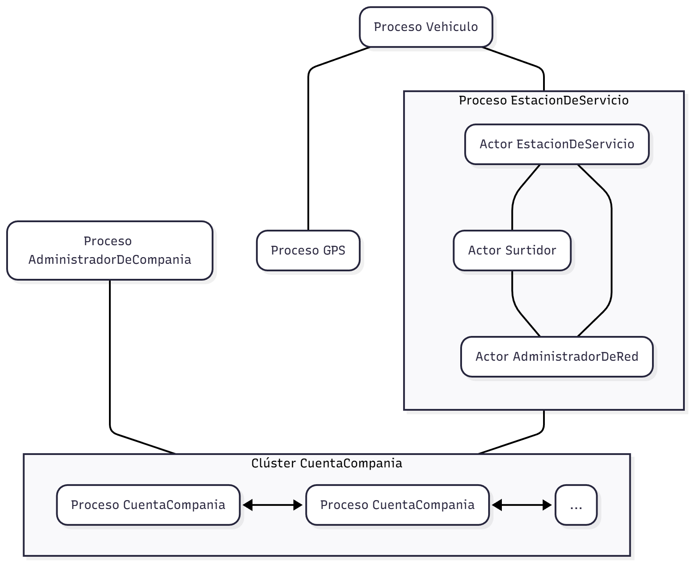

---

## Protocolos de Comunicación

### Protocolo de Transporte

Se utiliza **TCP** para toda la comunicación entre los procesos. Se elige TCP por su fiabilidad, entrega ordenada de paquetes y control de errores, características indispensables para implementar los protocolos de elección.

### Protocolo de Aplicación

Se define un protocolo personalizado sobre TCP. Cada mensaje enviado consiste en:

- **Header**: tipo de mensaje y longitud del payload
- **Payload**: el struct del mensaje serializado en formato JSON

### Manejo de Comunicación entre Procesos

Para gestionar la comunicación entre procesos, se utilizarán actores especializados:

- **Actor Acceptor**: Responsable de aceptar nuevas conexiones TCP entrantes desde otros procesos.
- **Actor Communication Handler**: Una vez establecida la conexión, este actor gestiona la comunicación bidireccional con el proceso remoto, enviando y recibiendo mensajes.
- Cada actor de la lógica de negocio que necesite comunicarse con otro proceso lo hará a través de su Communication Handler correspondiente, delegando así la responsabilidad de la comunicación de red.

### Mensajes de Comunicación entre Procesos

#### NuevaConexion

**De: Actor Acceptor → Actor de lógica de negocio**

El Acceptor notifica que ha aceptado una nueva conexión TCP y ha creado un Communication Handler para gestionarla.

```rust
struct NuevaConexion {
    handler_addr: Addr<T>, // Dirección del Communication Handler creado
    direccion_remota: String,
}
```

#### EnviarMensaje

**De: Actor de lógica de negocio → Actor Communication Handler**

Un actor de lógica de negocio solicita al Communication Handler enviar un mensaje a un proceso remoto.

```rust
struct EnviarMensaje {
    tipo_mensaje: String,
    payload: String, // JSON serializado
}
```

#### MensajeRecibido

**De: Actor Communication Handler → Actor de lógica de negocio**

El Communication Handler notifica al actor correspondiente que ha recibido un mensaje del proceso remoto.

```rust
struct MensajeRecibido {
    tipo_mensaje: String,
    payload: String, // JSON serializado
}
```

#### ErrorConexion

**De: Actor Communication Handler → Actor de lógica de negocio**

El Communication Handler notifica que ha ocurrido un error en la comunicación.

```rust
struct ErrorConexion {
    descripcion: String,
}
```

#### CerrarConexion

**De: Actor de lógica de negocio → Actor Communication Handler**

Se solicita cerrar una conexión activa.

```rust
struct CerrarConexion {
    motivo: String,
}
```

---

## Modelos de Concurrencia Distribuida

## Mecanismo de Backup

En el modelo planteado, es necesario transmitir la información del líder a otra `CuentaCompania`. De lo contrario, se perderá información si se produce una caída del nodo.

Para esto, implementamos un mecanismo en el cual el nodo líder elige aleatoriamente otro nodo como réplica. Este nodo mantendrá toda la información del nodo líder y será actualizado cada vez que este reciba una actualización.

De esta forma, cuando caiga el nodo líder, se elegirá una nueva `CuentaCompania` para que pase a ser el líder. Una vez se decida cuál será el líder, este se comunicará con el resto de los nodos para anunciar su liderazgo, y estos responderán con su información. Además, el backup responderá con la información del líder anterior adicionada a la suya. La `CuentaCompania` que era réplica dejará de serlo, y el nuevo líder elegirá otra réplica para evitar la pérdida de información y continuar el ciclo.

## Elección de Líder

Para elegir el líder, utilizamos el **Algoritmo Bully**. Ante la caída de una `CuentaCompania`, esta dejará de contestar los mensajes. Se establece un _timeout_, de manera que si no responde por cierto tiempo, se lo considera caído y se busca un nuevo líder.

Para esto, cada nodo enviará un mensaje `Eleccion` con su propio ID a aquellos que tengan un ID mayor. Estos responderán con un `Ok` y continuarán ellos mismos el proceso de coordinación para elegir un líder.

```rust
struct Eleccion {
    id_cuenta: u32,
}
```

```rust
struct Ok {}
```

Llegado a un punto, solo la `CuentaCompania` con ID mayor será el coordinador (nadie le puede responder `Ok` ya que nadie tiene un ID mayor). De esta manera, se convierte en el nuevo líder y anunciará su liderazgo enviando un mensaje `Coordinador` a todos.

```rust
struct Coordinador {
    id_cuenta_lider: u32,
}
```

Las otras `CuentaCompania` responderán con su estado actual, y solo enviarán actualizaciones cuando sea necesario al nuevo líder.

```rust
struct ActualizarLider {
    estado: EstadoCompania,
}
```

Adicionalmente, la `CuentaCompania` réplica responderá al mensaje `Coordinador` con la última información que tenía el anterior líder hasta el momento de la caída, y luego dejará de ser réplica. Finalmente, el nuevo líder elegirá como réplica al nodo que le respondió primero.

---

## Casos de Interés

### Caso Feliz: Carga de Combustible Exitosa

Este escenario describe el flujo completo de una carga de combustible cuando todos los componentes del sistema funcionan correctamente y la red está estable.

1.  Un `Vehiculo` consulta al `GPS` por estaciones enviando `SolicitarEstacionesCercanas`.
2.  El `GPS` responde con `EnviarEstacionesCercanas`.
3.  El `Vehiculo` elige una `EstacionDeServicio` y le envía una `SolicitarCarga`.
4.  La `EstacionDeServicio` verifica su estado y encuentra un `Surtidor` libre (marcado como `true` en el `HashMap`).
5.  Envía un mensaje `IniciarCarga` al `Surtidor` libre.
6.  El `Surtidor` simula el tiempo de carga y, al finalizar, realiza dos acciones:
    - Envía `RegistrarTransaccion` al `AdministradorDeRed` con los detalles del monto.
    - Envía `SurtidorLibre` a la `EstacionDeServicio` para que esta pueda atender a otros vehículos.
7.  El `AdministradorDeRed` recibe `RegistrarTransaccion` y, al tener conexión estable con el clúster, envía el mensaje `RegistrarTransaccion` al nodo `CuentaCompania` correspondiente (Nodo C).
8.  El Nodo C valida que el `monto` no excede el `limite`.
9.  El Nodo C le envía al líder esta última actualización que realizó.
10. El Líder actualiza el `estado_global`.
11. El Nodo C envía un `ResultadoTransaccion` (con `resultado: true`) de vuelta al `AdministradorDeRed`.
12. El `AdministradorDeRed` recibe la confirmación y la reenvía a la `EstacionDeServicio` (como `ResultadoTransaccion`).
13. La `EstacionDeServicio` envía `RespuestaCarga` (con `aceptada: true`) al `Vehiculo` original, finalizando el proceso.

### Caso de Falla: Modo Offline (Store and Forward)

Este escenario describe qué sucede cuando el `AdministradorDeRed` no puede conectarse al clúster de `CuentaCompania`, pero la estación de servicio sigue operando.

1.  Los pasos 1-6 del "Caso Feliz" ocurren normalmente. El `Surtidor` envía `RegistrarTransaccion` al `AdministradorDeRed`.
2.  El `AdministradorDeRed` intenta enviar `RegistrarTransaccion` al nodo `CuentaCompania` correspondiente.
3.  La conexión TCP falla (ej. timeout por red local caída, o porque el nodo `CuentaCompania` específico está caído).
4.  El `AdministradorDeRed` activa el patrón **Store and Forward**: almacena el `RegistroTransaccion` en su `cola_persistente`.
5.  Como el `AdministradorDeRed` ha almacenado exitosamente la transacción en su cola (garantizando el procesamiento futuro), considera la transacción **"aceptada localmente"**.
6.  El `AdministradorDeRed` informa a la `EstacionDeServicio` enviando `ResultadoTransaccion { aceptada: true }`.
7.  La `EstacionDeServicio` recibe esta confirmación local y envía `RespuestaCarga { aceptada: true }` al `Vehiculo`.
8.  El `Vehiculo` se retira, considerando la carga y el pago como exitosos.
9.  Posteriormente, la conexión de red se restablece.
10. El `AdministradorDeRed` tiene una lógica para reintentar enviar los mensajes en su `cola_persistente`.
11. El `AdministradorDeRed` logra enviar la transacción almacenada al nodo `CuentaCompania`.
12. La transacción se procesa en el clúster (siguiendo los pasos 8-14 del "Caso Feliz") y el `AdministradorDeRed` recibe un `ResultadoTransaccion { aceptada: true }` (esta vez, la confirmación real del clúster).
13. El `AdministradorDeRed` elimina la transacción de su `cola_persistente`. El cobro se ha reconciliado de forma asíncrona sin afectar la experiencia del cliente.

### Caso de Falla: Caída del Nodo Líder del Clúster

Este escenario describe la activación de los mecanismos de tolerancia a fallos cuando el nodo Líder de `CuentaCompania` deja de funcionar.

1.  El nodo `CuentaCompania` (Líder) sufre una falla (ej. se cae el proceso o pierde conexión de red).
2.  Otro proceso (ej. un nodo `CuentaCompania` intentando sincronizar una transacción, u otro nodo por un _timeout_ de _heartbeat_) intenta comunicarse con el Líder y falla.
3.  Al detectar la ausencia del Líder, un nodo `CuentaCompania` inicia el **Algoritmo Bully** para la elección de un nuevo líder.
4.  Este nodo (Nodo A) envía un mensaje `Eleccion` a todos los nodos con un `id` mayor al suyo.
5.  Un nodo con ID mayor (Nodo B) recibe `Eleccion` y responde con `Ok` al Nodo A, tomando el control del proceso de elección. El Nodo B ahora repite el paso 4.
6.  Este proceso continúa hasta que un nodo (Nodo Z), que es el nodo con el `id` más alto entre todos los nodos _vivos_, envía mensajes `Eleccion` y no recibe ninguna respuesta `Ok` (ya que no hay nadie con ID mayor).
7.  El Nodo Z se autoproclama el nuevo **Líder**.
8.  El Nodo Z anuncia su nuevo rol enviando un mensaje `Coordinador` a todos los demás nodos del clúster.
9.  Los nodos restantes reciben `Coordinador` y actualizan su referencia al Líder.
10. **Recuperación de Estado:**
    - Los nodos comunes responden al nuevo Líder con `ActualizarLider` enviando su estado local.
    - El nodo que actuaba como **Réplica** del líder caído, al recibir `Coordinador`, responde enviando la información que tenía respaldada del líder anterior _además_ de su propio estado.
11. El nuevo Líder (Nodo Z) utiliza la información de la antigua Réplica y demás nodos para reconstruir el `estado_global` completo y consistente.
12. La antigua Réplica deja de serlo (`dejará de ser réplica`).
13. El nuevo Líder elige un nuevo nodo como Réplica (según el diseño, "al nodo que le respondió primero") y le envía su estado local para sincronizarlo.
14. El clúster vuelve a estar operativo y consistente.

### Caso de Falla: Caída de un Nodo No-Líder

Este escenario cubre la falla de un nodo `CuentaCompania` que no es el Líder.

#### Escenario A: Cae un nodo común (no-líder, no-réplica)

1.  Un nodo `CuentaCompania` (Nodo X) falla.
2.  El **Líder** detecta la falla (ej. por _heartbeats_ fallidos).
3.  El Líder actualiza su `estado_global` marcando al Nodo X como inactivo.
4.  El clúster sigue 100% operativo. No se requiere una nueva elección.
5.  Si un `AdministradorDeRed` intenta contactar específicamente al Nodo X (porque la transacción corresponde a esa compañía), se activará el **Caso de Falla: Modo Offline (Store and Forward)**. La transacción quedará pendiente en la `cola_persistente` del administrador de red hasta que el Nodo X se recupere.
6.  Cuando el Nodo X caído se recupere, el líder le enviará su estado local previo a la caída para sincronizarse nuevamente.

#### Escenario B: Cae el nodo Réplica

1.  El nodo `CuentaCompania` que actúa como **Réplica** (Nodo R) falla.
2.  El **Líder** detecta la falla al intentar enviarle una actualización de estado (como en el paso 11 del "Caso Feliz").
3.  El Líder marca al Nodo R como inactivo en su `estado_global`.
4.  El clúster sigue operativo, pero temporalmente en un estado vulnerable (sin backup).
5.  El Líder inmediatamente elige un nuevo nodo (ej. "al que le respondió primero" en la última elección, o aleatoriamente) para que actúe como la nueva **Réplica**.
6.  El Líder envía su estado local a esta nueva Réplica para sincronizarla.
7.  Una vez sincronizada, el sistema vuelve a ser tolerante a fallos.

---

## Cambios Estructurales en el Diseño

### Arquitectura de Comunicación entre Procesos

La comunicación entre procesos se gestiona mediante actores especializados que separan las responsabilidades de red de la lógica de negocio:

#### Actores de Red

- **Acceptor**: Escucha en un puerto TCP y acepta conexiones entrantes. Por cada nueva conexión, crea un `CommunicationHandler` dedicado y notifica al actor de negocio mediante `NuevaConexion`.

- **CommunicationHandler**: Maneja la comunicación bidireccional sobre una conexión TCP. Serializa/deserializa mensajes en JSON, implementa el protocolo (header con tipo y longitud + payload), y notifica eventos al actor de negocio (`MensajeRecibido`, `ErrorConexion`).

- **Initiator** (rol): Los actores de negocio que necesitan conectarse a otros procesos inician conexiones TCP salientes, creando su propio `CommunicationHandler` para gestionar la comunicación.

#### Flujos de Conexión

**Conexión Entrante**: `Acceptor` acepta → crea `CommunicationHandler` → envía `NuevaConexion` al actor de negocio → comunicación bidireccional

**Conexión Saliente**: Actor de negocio inicia conexión TCP → crea `CommunicationHandler` → comienza intercambio de mensajes

Cada actor delega completamente la gestión de red a sus handlers, interactuando solo mediante `EnviarMensaje` (envío) y `MensajeRecibido` (recepción).

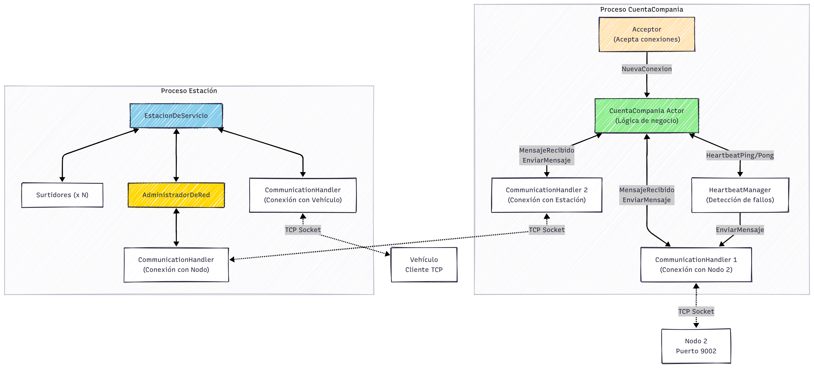

### Centralización del Estado en el Líder

**Diseño Original**: Cada nodo `CuentaCompania` mantenía su propio estado local (`estado_local`) y el líder mantenía un estado global opcional con referencias a los estados de todos los nodos.

**Implementación Final**: El estado se centralizó completamente en el nodo líder. Solo el líder mantiene el `estado_global` completo en un `HashMap<u32, EstadoCompania>` donde la clave es el `compania_id`. Los nodos no-líderes ya no mantienen estado propio, sino que actúan como intermediarios que bufferean transacciones y las envían al líder para procesamiento.

**Justificación**: Esta arquitectura simplifica la consistencia distribuida, eliminando la necesidad de sincronización entre múltiples copias del estado. El líder es la única fuente de verdad, y la réplica mantiene una copia completa para recuperación ante fallos.

### Mecanismo de Réplica y Recuperación de Estado

**Diseño Original**: El backup almacenaba solo su propio estado y respondería con él tras una elección.

**Implementación Final**:

- El líder selecciona una réplica (inicialmente, el nodo con mayor ID disponible)
- La réplica recibe el estado global completo mediante el mensaje `ESTADO_INICIAL`
- Ante cada transacción aprobada, el líder sincroniza el cambio con la réplica via `SYNC_TRANSACCIONES`
- Si el líder cae, la réplica transfiere el estado global al nuevo líder mediante `ESTADO_TRANSFERIDO_REPLICA`
- El nuevo líder mergea este estado con el de otros nodos (si los hubiera) para reconstruir el estado completo

**Casos de Caída**:

- **Caída del Líder**: Se activa el algoritmo Bully. El nodo con mayor ID restante gana la elección. La antigua réplica (si sobrevivió) envía todo el estado global al nuevo líder, quien lo restaura completamente y elige una nueva réplica.

  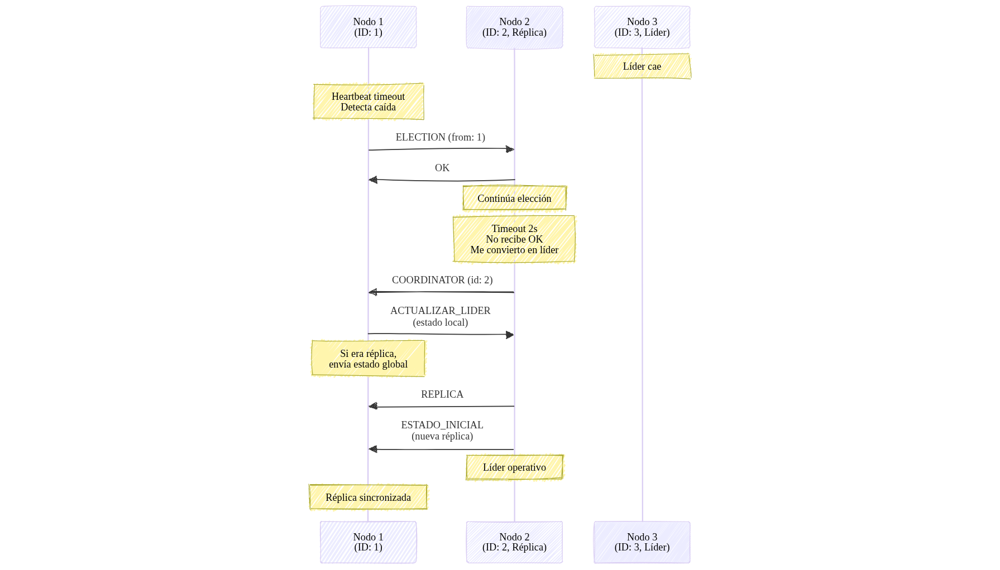

- **Caída de la Réplica**: El líder detecta la desconexión y automáticamente elige una nueva réplica entre los nodos disponibles, sincronizándola inmediatamente con el estado global actual.

  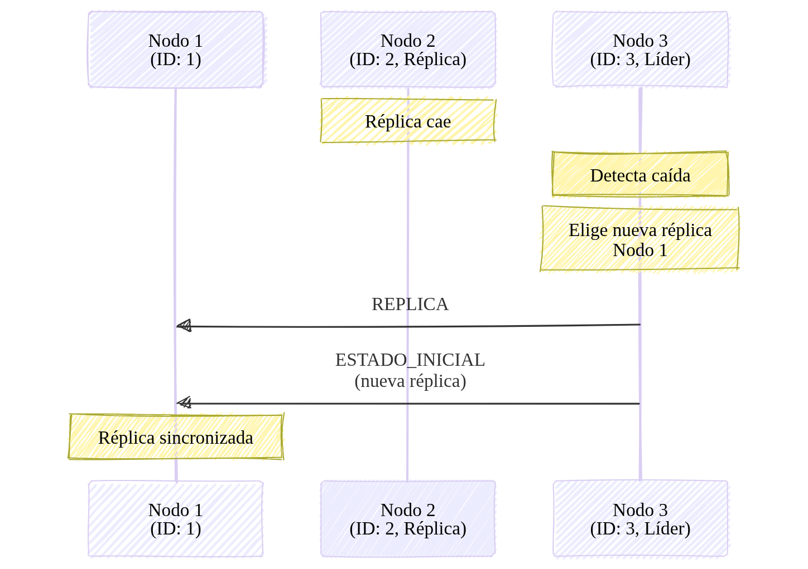

- **Caída de un Nodo Común**: No afecta la operación del clúster. El líder simplemente lo marca como inactivo. Si una estación de servicio está conectada a ese nodo común, el `AdministradorDeRed` detecta la caída y rota automáticamente a otro nodo común disponible para continuar operando.

  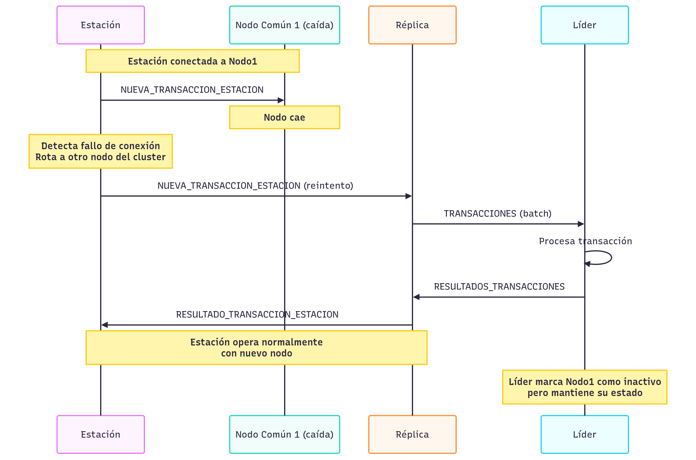

### Heartbeats y Detección de Fallos

**Componente**: `HeartbeatManager`

Cada nodo `CuentaCompania` tiene un `HeartbeatManager` que:

- Envía `HEARTBEAT_PING` periódicamente a sus vecinos (cada **2 segundos** por defecto)
- Espera `HEARTBEAT_PONG` en respuesta
- Mantiene un `HeartbeatState` por cada vecino con timestamp del último ping recibido
- Si un vecino no responde en `failure_timeout` (**6 segundos** = 3 intervalos de ping), se considera caído

**Detección de Caída del Líder**: Cuando un nodo detecta que su líder cayó (vía heartbeats o error de conexión), inmediatamente inicia una nueva elección con el algoritmo Bully.

### Descubrimiento Dinámico del Líder

**Nuevo Protocolo**: `WHO_IS_LEADER` / `LEADER_INFO`

Los clientes (`AdministradorDeCompania`) no conocen de antemano quién es el líder:

1. Al iniciar, el cliente envía `WHO_IS_LEADER` a cualquier nodo del cluster
2. El nodo responde con `LEADER_INFO` conteniendo la dirección del líder actual (`leader_address`)
3. El cliente establece conexión directa con el líder
4. Ante error de conexión, el cliente detecta la caída del líder, reencola los comandos pendientes, y reinicia el proceso de descubrimiento (excluyendo al líder caído)

**Comandos Pendientes**: El `AdministradorDeCompania` mantiene una cola `comandos_pendientes` que almacena todas las operaciones solicitadas mientras no hay conexión con el líder. Una vez conectado, procesa todos los comandos encolados secuencialmente.

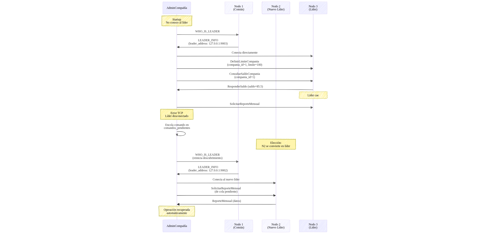

### Buffering y Batching de Transacciones

**Diseño Original**: Los nodos no-líderes procesaban transacciones localmente y luego notificaban al líder.

**Implementación Final**: Los nodos no-líderes implementan un buffer (`buffer_transacciones: Vec<TransaccionPendiente>`) que acumula hasta `N` transacciones antes de enviarlas en batch al líder mediante el mensaje `TRANSACCIONES`. Esto reduce la sobrecarga de red y mejora el throughput.

El líder procesa el batch completo, valida cada transacción contra el estado global, y responde con `RESULTADOS_TRANSACCIONES` conteniendo el resultado individual de cada una.

### Idempotencia para Exactly-Once Semantics

**`AlmacenIdempotencia`**: Cada líder mantiene un log persistente (`log_idempotencia_compania_{id}.jsonl`) con los IDs de transacciones procesadas.

**Flujo**:

1. Transacción llega con ID único: `{vehiculo_id}-{compania_id}-{contador_carga}`
2. Líder consulta `AlmacenIdempotencia` (HashSet en memoria)
3. Si ID existe: responder éxito inmediatamente (idempotencia)
4. Si ID no existe: validar, aplicar, registrar, responder

**Generación de IDs**: El vehículo mantiene un `contador_carga` incremental. Ante reintentos por timeout, **reutiliza el mismo contador**, generando el mismo ID y previniendo duplicados.

### Store and Forward en Estaciones

- Cada estación mantiene un log persistente de transacciones (`log_estacion_{id}.jsonl`)
- Estados de transacción: `Pendiente` (no confirmada por cluster) o `Confirmada` (con resultado del cluster)
- Al registrar una transacción desde un surtidor:
  1. Se escribe inmediatamente a disco como `Pendiente`
  2. Si hay conexión al cluster, se envía
  3. Si no hay conexión, queda en log para reenvío posterior
- Ante reconexión, el administrador lee el log, identifica transacciones pendientes, y las reenvía automáticamente
- Al recibir `RESULTADO_TRANSACCION_ESTACION`, actualiza el estado a `Confirmada` con el resultado

**Cache `transaccion_a_surtidor`**: Mapa en memoria que asocia ID de transacción con surtidor solicitante, permitiendo:

- Redirigir respuestas retrasadas al surtidor correcto
- Detectar reintentos del mismo vehículo y responder desde cache si está `Confirmada`
- Idempotencia a nivel estación (complementa la del cluster)

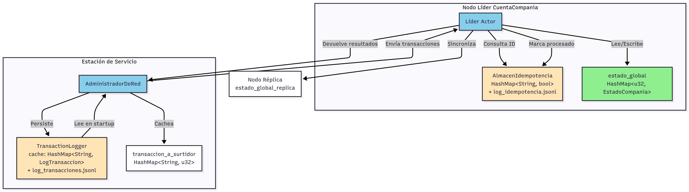

## Flujos de Operación Implementados

### Flujo de Carga de Combustible (Caso Exitoso)

Flujo completo cuando todos los componentes funcionan correctamente: vehículo solicita ubicación al GPS, se conecta a la estación, el surtidor valida la transacción con el cluster (verificando idempotencia y límites), y finalmente se completa la carga.

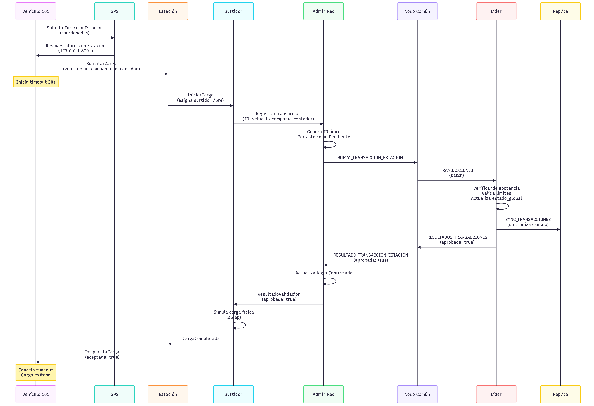

### Flujo de Store and Forward con Timeout y Reintento del Vehículo

Combina **persistencia local** (estación) con **reintentos del vehículo** para disponibilidad eventual.

**Escenario sin conexión**: La estación persiste transacciones como `Pendiente`, el vehículo reintenta hasta 5 veces (30s c/u) con el mismo `contador_carga` (mismo ID). Si tras 150s no hay respuesta, aborta.

**Escenario con reconexión**: Al recuperar conectividad, la estación reenvía transacciones pendientes al cluster. El siguiente reintento del vehículo obtiene respuesta inmediata desde cache (idempotencia a nivel estación).

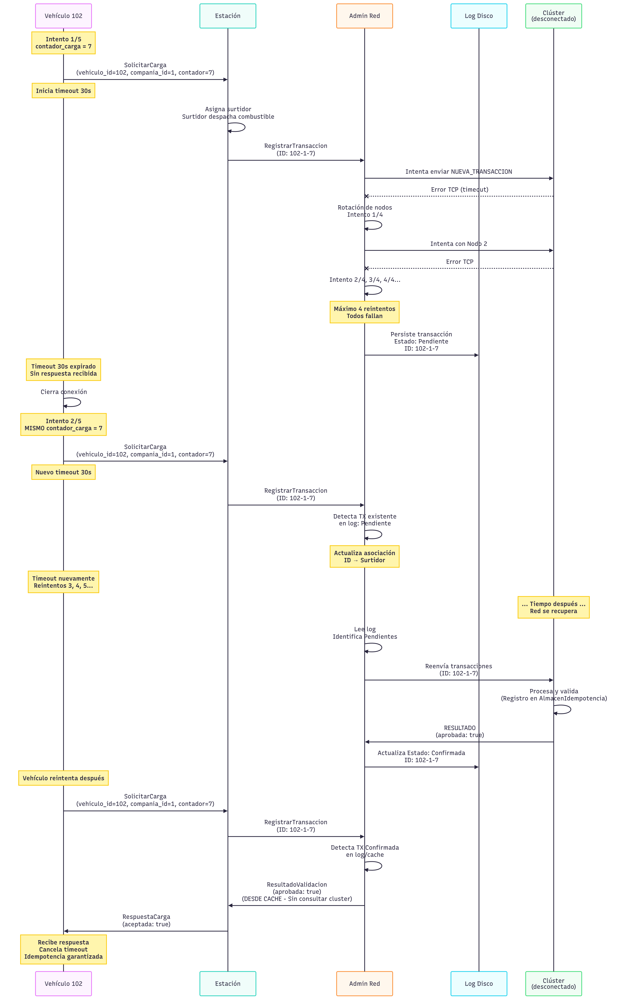

---

## Diagramas de Arquitectura

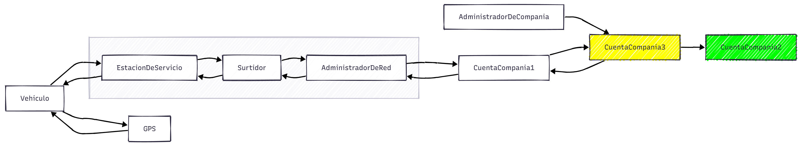

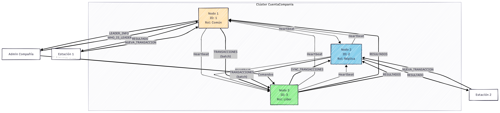

---

# Ejecución del Sistema

## Requisitos Previos

- **Rust** (versión 1.70 o superior)
- **Cargo** (instalado con Rust)

## Compilación del Proyecto

Desde el directorio raíz del proyecto:

```bash
cargo build --release
```

Esto compilará todos los binarios en modo optimizado. Los ejecutables estarán disponibles en `target/release/`.

## Ejecución de Programas

### 1. Clúster de CuentaCompania

El clúster debe iniciarse **antes** que cualquier otro componente. Se requieren al menos 3 nodos para tolerancia a fallos.

```bash
# Nodo 1 (ID: 1, Puerto: 9001)
./target/release/cuenta_compania 1 127.0.0.1:9001 "2:127.0.0.1:9002,3:127.0.0.1:9003" 3

# Nodo 2 (ID: 2, Puerto: 9002)
./target/release/cuenta_compania 2 127.0.0.1:9002 "1:127.0.0.1:9001,3:127.0.0.1:9003" 3

# Nodo 3 (ID: 3, Puerto: 9003)
./target/release/cuenta_compania 3 127.0.0.1:9003 "1:127.0.0.1:9001,2:127.0.0.1:9002" 3 1
```

**Formato**: `cuenta_compania <id> <bind_addr> <lista_vecinos> <buffer_size> [reconnection_flag]`

- `<id>`: Identificador único del nodo (usado en algoritmo Bully)
- `<bind_addr>`: Dirección IP y puerto donde escucha el nodo (formato IP:puerto)
- `<lista_vecinos>`: Lista separada por comas de direcciones de otros nodos (formato id:IP:puerto)
- `<buffer_size>`: Tamaño del buffer de transacciones
- `[reconnection_flag]`: Flag opcional que indica si se trata de una reconexión (0 o 1)

### 2. Servicio GPS

```bash
echo "100 200 127.0.0.1:8001" | ./target/release/gps 127.0.0.1:7000
```

El GPS requiere entrada por stdin con el formato `<latitud> <longitud> <ip:puerto_estacion>` para cada estación, terminando con una línea vacía.

### 3. Estaciones de Servicio

```bash
# Estación 1
echo -e "127.0.0.1:9001\n127.0.0.1:9002\n127.0.0.1:9003" | ./target/release/estacion 1 2 127.0.0.1:8001

# Estación 2  
echo -e "127.0.0.1:9001\n127.0.0.1:9002\n127.0.0.1:9003" | ./target/release/estacion 2 2 127.0.0.1:8002

# Estación 3
echo -e "127.0.0.1:9001\n127.0.0.1:9002\n127.0.0.1:9003" | ./target/release/estacion 3 2 127.0.0.1:8003
```

**Formato**: `estacion <id> <cantidad_surtidores> <bind_addr>`

- `<id>`: Identificador único de la estación
- `<cantidad_surtidores>`: Número de surtidores de la estación
- `<bind_addr>`: Dirección IP y puerto donde escucha la estación
- **Entrada por stdin**: Lista de direcciones de nodos del clúster (una por línea), terminando con línea vacía

### 4. Administrador de Compañía

```bash
./target/release/admin_compania 1 9100
```

**Formato**: `admin_compania <compania_id> <bind_port>`

- `<compania_id>`: ID de la compañía a administrar
- `<bind_port>`: Puerto local donde escucha el administrador

El administrador permite realizar operaciones como:

- Definir límites de consumo
- Consultar saldos
- Solicitar reportes mensuales

### 5. Vehículos

```bash
echo "127.0.0.1:7000" | ./target/release/vehiculo 101 1 100 200
```

**Formato**: `vehiculo <vehiculo_id> <compania_id> <latitud> <longitud>`

- `<vehiculo_id>`: Identificador único del vehículo
- `<compania_id>`: ID de la compañía a la que pertenece
- `<latitud>`: Coordenada de latitud inicial del vehículo
- `<longitud>`: Coordenada de longitud inicial del vehículo
- **Entrada por stdin**: Dirección del servicio GPS

## Scripts de Prueba

El directorio `scripts/` contiene varios scripts para facilitar la ejecución y pruebas de escenarios específicos.

### Script de Ejecución por Defecto

```bash
./scripts/default.sh
```

Inicia un clúster de 3 nodos, el GPS, 3 estaciones y varios vehículos en una configuración estándar.

### Scripts de Simulación de Fallos

#### Falla de Internet (Store and Forward)

```bash
./scripts/falla_internet.sh
```

Simula la caída de la conexión entre una estación y el clúster, activando el mecanismo de Store and Forward.

#### Falla del Líder

```bash
./scripts/falla_lider.sh
```

Simula la caída del nodo líder del clúster, activando el algoritmo Bully para elección de un nuevo líder.

#### Falla de un Nodo Común

```bash
./scripts/falla_nodo.sh
```

Simula la caída de un nodo no-líder del clúster, demostrando la continuidad del servicio.

#### Falla de la Réplica

```bash
./scripts/falla_replica.sh
```

Simula la caída del nodo réplica, mostrando la selección automática de una nueva réplica.

### Script de Reconexión

```bash
./scripts/reconexion.sh
```

Simula la recuperación de conexión tras una falla, demostrando el reenvío automático de transacciones pendientes.

### Detener el Sistema

```bash
./scripts/stop.sh
```

Detiene todos los procesos en ejecución del sistema de forma ordenada.

## Configuración del Clúster

El archivo `cluster_config.txt` contiene la configuración de los nodos del clúster:

```txt
1,127.0.0.1:9001 10000
2,127.0.0.1:9002 10000
3,127.0.0.1:9003 10000
```

**Formato**: `<id>,<dirección>:<puerto>`

Este archivo es leído por los scripts para automatizar el inicio del clúster.

## Logs y Persistencia

Los datos persistentes se almacenan en archivos JSON Lines (`.jsonl`) en el directorio de ejecución:

- `log_idempotencia_compania_{id}.jsonl`: Log de transacciones procesadas por el líder
- `log_estacion_{id}.jsonl`: Log de transacciones de cada estación (Store and Forward)
- `estado_compania_{id}.jsonl`: Estado persistido de cada nodo del clúster
